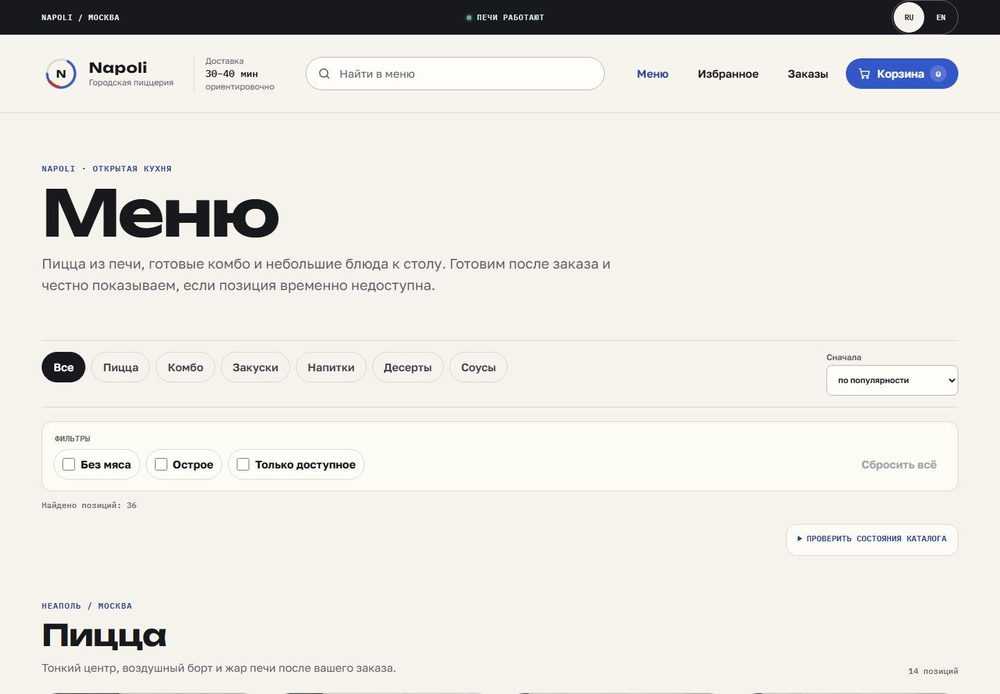

<!-- generated-by: gsd-doc-writer -->
# Napoli



Репозиторий: [godaylor/napoli-pizza](https://github.com/godaylor/napoli-pizza).

Сайт: [napoli-pizza-tau.vercel.app](https://napoli-pizza-tau.vercel.app).

Портфолио-версия городской пиццерии: от общего URL меню и конфигуратора до гостевого checkout, mock payment, подтверждения и tracking. Репозиторий включает защищённый server-side order API и Supabase migration; публичный сайт продолжает работать в demo mode, пока владелец не подключит hosting secrets.

## Возможности

- owned каталог без tutorial API, URL-owned поиск/категории/фильтры/сортировка;
- конфигурируемые пиццы, фиксированные комбо и contextual recommendations;
- persistent cart с edit, quantity, remove, undo и clear;
- delivery/pickup, ASAP/scheduled time, promo и authoritative final quote;
- безопасная симуляция оплаты без PAN/CVC и idempotent создание заказа;
- reload-safe confirmation/tracking, локальные favorites, sanitized history и repeat order;
- русский интерфейс по умолчанию и сохраняемый переключатель RU/EN, включая каталог и metadata;
- явные loading, empty, unavailable, error, stale и offline recovery states.

## Installation

Нужен Node.js `24.20.0` из `.nvmrc`.
Корневая папка и package metadata: `06-napoli`. Без env приложение использует полностью рабочий local demo repository; server mode описан в [Deployment](docs/DEPLOYMENT.md).

```bash
npm ci
npx playwright install chromium firefox webkit
```

## Quick start

1. Запустите dev server:

   ```bash
   npm run dev
   ```

2. Откройте `http://127.0.0.1:32500/menu`. При занятом порте Vite остановится; чужой процесс не завершайте.

Production preview:

```bash
npm run build
npm run preview
```

## Usage examples

1. Откройте `/menu?category=pizza&sort=price-asc`, настройте пиццу и убедитесь, что разные конфигурации остаются разными строками корзины.
2. Добавьте комбо «Вечер на двоих», пройдите delivery или pickup checkout, примените `NAPOLI10` и подтвердите mock payment.
3. На confirmation откройте tracking, переключайте demo-время, затем проверьте reload-safe статус и sanitized history в `/orders`.

## Quality gate

```bash
npm run typecheck
npm run lint
npm run test
npm run test:coverage
npm run build
npm run test:e2e -- --workers=4
npm run test:performance
```

Browser gate использует Chromium mobile/desktop, Firefox desktop и WebKit mobile. Подробности — в [TESTING.md](docs/TESTING.md) и [RELEASE.md](docs/RELEASE.md).

## Privacy and demo boundaries

Регистрация не нужна. Mock payment не показывает полей карты и не принимает реальные платёжные реквизиты. В demo mode полный guest contact/address/note хранится только в активном `sessionStorage`; локальная история исключает эти данные. В server mode полный snapshot передаётся same-origin Vercel Function и хранится в закрытых Supabase-таблицах; браузер не получает database key. Optional Supabase account/auth не входит в release — решение зафиксировано в [ADR-001](docs/ADR-001-SKIP-M11-SUPABASE.md).

## Documentation

- [Getting started](docs/GETTING-STARTED.md)
- [Development](docs/DEVELOPMENT.md)
- [Testing](docs/TESTING.md)
- [Configuration](docs/CONFIGURATION.md)
- [Deployment](docs/DEPLOYMENT.md)
- [Architecture](docs/ARCHITECTURE.md)

## Source and attribution

Napoli развивает исходный учебный репозиторий, сохраняя его git history и сведения об источнике. Upstream: [godaylor/react-pizza-v2](https://github.com/godaylor/react-pizza-v2).

Тексты лицензий зависимостей включены в [THIRD-PARTY-NOTICES.txt](public/THIRD-PARTY-NOTICES.txt) и обновляются при build. Статус прав на исходную базу, изображения и шрифты указан в [ASSET-LICENSES.md](docs/ASSET-LICENSES.md). Upstream-ссылка не является подтверждением лицензии на весь проект.
