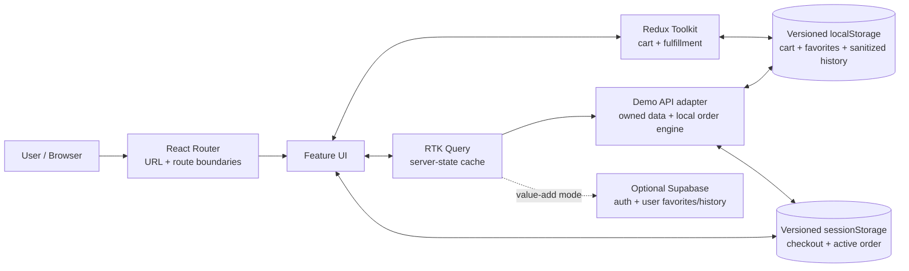

# Target architecture

Статус: proposed

Принцип: frontend-first consumer product, не enterprise platform.

## 1. Architecture goals

Целевая архитектура должна:

- поддерживать menu → configurator → cart → checkout → order lifecycle;
- разделять URL, client state, server state и local UI state;
- быть строгой на денежных/checkout boundaries;
- оставаться детерминированной для portfolio demo и tests;
- допускать узкий Supabase backend без переписывания UI;
- загружать code/data по мере пользовательского пути;
- иметь понятный failure-state contract;
- не создавать abstraction layers без второго реального потребителя.

## 2. Decision summary

| Topic | Decision | Status |
|---|---|---|
| CRA → Vite | **Да** | Foundation milestone |
| JavaScript → TypeScript | **Да, strict** | Foundation milestone |
| React | Сохранить React; обновить major отдельно от bundler switch, под tests | Planned |
| React Router | Сохранить, перейти на route config/lazy/error boundaries | Planned |
| Redux Toolkit | **Сохранить** для cart/fulfillment; checkout draft route-owned, пока не доказан multi-route lifecycle | Planned |
| Filter state in Redux | Удалить; URL — source of truth | Planned |
| RTK Query vs TanStack Query | **RTK Query** | Chosen |
| Current MockAPI | Заменить owned typed data/API contract | Required |
| Supabase | Не core prerequisite; narrow value-add для auth/history/favorites/orders | Conditional |
| Cart persistence | Versioned `localStorage`, не whole-store persistence | Chosen |
| Styling | CSS Modules + Sass + CSS custom-property tokens | Chosen |
| Forms | Native semantics + React Hook Form for checkout; runtime schema only at boundaries | Planned |
| Runtime validation | Zod (или эквивалент) только URL/API/persistence/forms boundaries | Planned |
| Unit/integration | Vitest + Testing Library + MSW | Planned |
| Browser E2E | Playwright + axe | Planned |
| SSR/Next.js | Нет без SEO/business requirement | Rejected |
| PWA | Нет в core; offline-aware UI only | Deferred |

## 3. Why these decisions

### 3.1 CRA → Vite

React официально deprecated Create React App и рекомендует существующим SPA framework либо build tool вроде Vite. Для этого проекта Vite лучше framework migration:

- приложение остаётся client-side food ordering SPA;
- SSR не требуется для ключевого portfolio outcome;
- скрытый `react-scripts` toolchain — главный источник dependency debt;
- Vitest и explicit config упрощают quality gates;
- route chunks и asset pipeline прозрачнее.

Current stable toolchain выбирается в момент implementation и фиксируется lockfile. Vite compatibility floor не следует путать с project runtime recommendation. На дату аудита Node 24 — Active LTS; именно текущую Active LTS нужно закрепить в `engines`, CI и одном version file при начале migration.

Browser contract: проект осознанно принимает Vite default **Baseline Widely Available**, без legacy plugin. Release E2E запускается на актуальных Playwright Chromium, Firefox и WebKit; критические responsive smoke-проверки дополнительно проходят на 320/390/768/1024/1440 px. Если работодатель или hosting позже потребует старые браузеры, это отдельное измеримое решение, а не скрытая совместимость из старого CRA `browserslist`.

Migration rule: сначала поведенчески эквивалентный Vite build, затем отдельный dependency-major upgrade. Не смешивать bundler migration, React major и redesign в один непроверяемый commit.

### 3.2 JavaScript → strict TypeScript

Кодовая база мала, а будущая domain model сложна. Ранняя полная миграция дешевле долгого mixed mode.

`strict: true` обязателен для:

- `Money`/minor units;
- variants/modifiers;
- cart line identity;
- URL codec;
- API responses/errors;
- checkout and order statuses;
- persistence schema/migrations;
- typed Redux hooks.

TypeScript не заменяет runtime validation. Ненадёжные URL, localStorage и remote responses проверяются отдельными schemas.

### 3.3 Keep Redux Toolkit

Сегодня Redux хранит только filters и не оправдан. Целевой продукт меняет вывод:

- cart доступен из header, menu, product, checkout;
- fulfillment context влияет на availability/fees/ETA;
- local favorites/history require coordinated persistence before backend.

Это долгоживущий, shared, user-authored client state — подходящая зона Redux.

Checkout draft по умолчанию принадлежит route/form. Отдельный `checkoutSlice` появляется только если фактический multi-route flow потребует сохранять один draft между маршрутами; сам факт существования checkout не является достаточной причиной.

Что Redux **не** хранит:

- URL filters;
- dropdown/modal visibility;
- полный RTK Query cache в persistence;
- form keystrokes без cross-route need;
- auth access token вручную.

### 3.4 RTK Query over TanStack Query

Обе библиотеки хорошо решают server state. Выбор RTK Query обусловлен не превосходством вообще, а текущей архитектурой:

- RTK уже остаётся;
- RTK Query входит в Redux Toolkit;
- один store/provider/devtools model;
- cache, status, cancellation, dedupe, invalidation, prefetch и optimistic patch;
- `cacheEntryAdded` подходит для order-event stream.

TanStack Query был бы предпочтительным, если бы Redux удалялся полностью. Использовать одновременно Redux Toolkit + TanStack Query для этого масштаба — лишняя mental model.

### 3.5 No mandatory backend for core

Frontend portfolio должен оставаться воспроизводимым. Core flow может быть убедительно реализован с:

- owned versioned catalog fixtures;
- typed demo API adapter;
- MSW для dev/tests/failure scenarios;
- local order engine/history для deployed demo;
- deterministic mock payment/tracking.

Supabase становится ценным, когда появляются реальные cross-device/auth use cases. Он не должен блокировать core guest milestones.

## 4. System context



The UI consumes one typed feature API. Demo/Supabase differences remain below feature components.

## 5. State ownership

| State | Source of truth | Persistence | Notes |
|---|---|---|---|
| `q`, category, sort, filters | React Router search params | URL | Pure validated codec; no pagination for the owned menu |
| Menu/products/availability | RTK Query | Cache only | Previous data retained during refetch |
| Product configurator draft | Local reducer/form | None until add | Edit flow seeds from cart line |
| Cart lines | `cartSlice` | Versioned localStorage | Derived totals not persisted |
| Delivery/pickup preference | `fulfillmentSlice` | Minimal localStorage | Quote stays server state |
| Checkout form | React Hook Form / route-owned | Session only if needed | Never payment fields |
| Quote/promo validation | RTK Query mutation/query | No | Authoritative response |
| Mock payment state | RTK Query mutation + route state | No secrets | Idempotent retry |
| Order query/status view | RTK Query cache | Cache only | Reads the repository/backend; cache is never the reload guarantee |
| Demo order snapshots/history | Versioned `DemoOrderRepository` | Session active snapshot + sanitized local history | Direct links restore in the same browser profile within retention |
| Favorites | Local slice initially; server endpoint after auth | Versioned local / backend | Optimistic with rollback |
| Auth session | Supabase SDK if enabled | SDK-managed | No manual Redux token |
| Popover/sheet visibility | Component local state | No | Focus lifecycle local |

### Catalog URL flow

```text
location.search
→ parseCatalogQuery(raw)
→ normalize defaults/unknowns
→ typed CatalogQuery
→ RTK Query args
→ catalog cache
→ MenuPage
```

Only Router writes catalog URL. No mirrored filter slice and no Search Context.

### Purchase flow

```text
Product + local configuration
→ pure validateConfiguration()
→ pure calculatePreviewPrice()
→ cartSlice.addLine(fingerprint)
→ persisted cart payload
→ quote mutation(cart + fulfillment + promo)
→ mock payment mutation
→ createOrder(idempotencyKey, quoteId)
→ confirmation / tracking query
```

## 6. Domain model

Money is an integer in minor units. Never use floating-point calculations for totals.

| Entity | Essential fields |
|---|---|
| `Category` | `id`, `slug`, `name`, `order`, `availability` |
| `Product` | `id`, `slug`, `kind` (`pizza/combo/side/drink/dessert/sauce`), `categoryId`, `name`, `description`, `searchAliases`, `image`, `badges`, `allergens`, optional `nutrition`, `variantIds`, `modifierGroupIds` |
| `ProductVariant` | `id`, `productId`, `size`, `dough`, `weight`, `basePriceMinor`, `available` |
| `Ingredient` | `id`, `name`, `searchAliases`, `allergens` |
| `ProductIngredient` | `productId`, `ingredientId`, product-specific `removable`; removal price effect is zero in core |
| `ModifierGroup` | `id`, `name`, `min`, `max`, `required`, `modifierIds` |
| `Modifier` | `id`, `name`, `priceDeltaMinor`, `available` |
| `FixedComboComposition` | `productId`, fixed component labels/IDs and comparison price; the `Product(kind: 'combo')` has exactly one non-configurable variant whose `basePriceMinor` is the bundle price |
| `Store` | `id`, `name`, `address`, `hours`, `pickupSlots` |
| `FulfillmentQuote` | `mode`, `eta`, `feeMinor`, `minimumMinor`, `slot`, `issues` |
| `CartConfiguration` | `productId`, `variantId`, sorted `removedIngredientIds`, sorted `{ groupId, modifierIds[] }` selections |
| `CartLine` | canonical `configuration`, `quantity`, stable `fingerprint` |
| `Promotion` | `code`, eligibility, discount, reason, expiry |
| `Quote` | lines, subtotal, discount, fee, total, issues, `expiresAt` |
| `Order` | `id`, quote snapshot, fulfillment, contact, payment status, status, timestamps |
| `OrderEvent` | `orderId`, `status`, `occurredAt`, `message` |
| `Favorite` | `userOrGuestId`, `productId`, timestamp |

`ProductIngredient` is the only stored Product↔Ingredient relation; no parallel `Product.ingredientIds` list is persisted.

Paid extras/add-ons are modeled as optional modifier groups, not a separate parallel entity. A configurable combo slot builder is outside core scope.

A fixed combo uses the ordinary canonical `CartConfiguration`: its product ID, sole variant ID and empty removal/modifier arrays. Therefore the same price formula, fingerprint, persistence and quote path applies without a parallel cart-line type.

### Cart fingerprint

```text
hash(canonicalSerialize({
  productId,
  variantId,
  removedIngredientIds: sort(removedIngredientIds),
  modifierSelections: sortByGroup(
    selections.map(group => ({
      groupId: group.id,
      modifierIds: sort(group.modifierIds)
    }))
  )
}))
```

The same canonical representation is used by fingerprint, persistence, quote, edit and reorder. Fingerprint logic is pure and unit-tested. Quantity is not part of identity.

### Price integrity

- UI preview derives from current typed catalog.
- Persisted line never stores trusted total.
- Quote layer recalculates line values, discounts and fee.
- Order stores a quote snapshot so history does not mutate with future catalog prices.
- Any quote change between cart and checkout returns an explainable issue.

## 7. API boundary

UI code must not know whether the source is local demo data or Supabase.

Minimal conceptual endpoints:

| Operation | Contract |
|---|---|
| List catalog | `GET /catalog?category&q&sort&filters` → `{ items, facets, total }` |
| Product details | `GET /products/:slug` → product + variants + modifier groups |
| Recommendations | `POST /recommendations` → contextual products/combos + reason |
| Fulfillment quote | `POST /fulfillment/quote` → ETA, slots, fee, minimum, issues |
| Promo/checkout quote | `POST /quotes` → authoritative totals + issues + expiry |
| Mock payment | `POST /payments/mock` → pending/success/declined/recoverable error |
| Create order | `POST /orders` + idempotency key → order snapshot |
| Order | `GET /orders/:id` → current order |
| Order events | `GET/subscribe /orders/:id/events` → ordered events |
| Favorites | list/toggle for authenticated user when backend enabled |

The demo adapter may implement these as typed async functions rather than a literal server. RTK Query remains the consumer-facing cache/lifecycle layer; persistence and reload guarantees belong to `DemoOrderRepository`, not to its cache.

### Error model

All feature APIs normalize errors to:

```text
code
message
recoverable
fieldErrors?
retryAfter?
correlationId?
```

Raw transport errors do not leak into UI copy.

Retry policy:

- safe GET: limited retry with backoff;
- promo/quote: manual or controlled retry;
- payment/order: no blind auto retry; recover by idempotency/status check.

## 8. Demo data and Supabase strategy

### Core data mode

- Owned, versioned fixtures are committed with the project.
- Images are controlled project assets with WebP/AVIF variants.
- MSW covers dev/test latency, 404, 500, offline, stale quote and payment outcomes.
- Deployed demo has a deterministic `DemoOrderRepository` and clock: full active checkout/order data is session-scoped; persistent guest history is sanitized, versioned, bounded and expired by policy.
- A small visible «demo scenarios» entry may expose failure cases without polluting normal UX.

This replaces the current public MockAPI immediately and makes test results reproducible.

### When Supabase is justified

Add it only if the milestone delivers all of:

- real passwordless session;
- cross-device favorites;
- server order history;
- guest-to-user merge.

Narrow Supabase scope:

- passwordless auth and minimal profile identity;
- `favorites`;
- sanitized user order history needed for cross-device repeat order;
- saved addresses are explicitly out of the first backend milestone;
- core catalog, quote, payment and live-looking tracking remain on the deterministic adapter in the first backend milestone.

Do not add custom Node/Nest backend, admin UI, queues or real payments.

### Supabase security requirements

- No `service_role`/secret key in SPA; only publishable client key.
- Explicit grants and RLS for every exposed table.
- Ownership predicate uses `auth.uid() = user_id`; `TO authenticated` alone is insufficient.
- Update policies include `USING` and `WITH CHECK`.
- Do not use user-editable metadata for authorization.
- Views exposed to clients use `security_invoker` or remain unexposed.
- New tables may not be auto-exposed to Data API; exposure/grants are explicit and tested.
- Anonymous/public catalog policy is read-only and separate from user data.
- Guest order access uses a scoped order token/demo strategy, not guessable sequential IDs alone.
- RLS tests and Supabase advisors are part of that milestone's DoD.

## 9. Persistence architecture

Use `localStorage` because cart/favorites/sanitized history payloads are small, synchronous hydration is useful, and IndexedDB complexity has no payoff here. Full active checkout/contact/address data is session-scoped instead.

Example envelope:

```text
{
  schemaVersion,
  savedAt,
  cart: { canonicalConfigurationLines, fulfillmentPreference },
  favorites: [productId],
  sanitizedOrderHistory: [{ id, lines, totals, status, fulfillmentMode, timestamps }]
}
```

`DemoOrderRepository` owns two deliberately different stores:

- a versioned `sessionStorage` active-order snapshot with the complete information required for same-session confirmation/tracking reload;
- a versioned, sanitized `localStorage` history limited to 20 orders and a 90-day TTL.

Therefore `/order/:id/confirmed` and `/order/:id/track` direct links work in the same browser profile while the relevant active snapshot or retained sanitized record exists. A new browser/device is supported only after the optional account milestone. RTK Query may cache reads from this repository, but never replaces it.

Rules:

- validate payload on hydration;
- migrate known versions;
- corrupt/unknown payload falls back safely and logs a non-PII diagnostic;
- write through listener middleware with throttle;
- cross-tab `storage` event sync is optional; `BroadcastChannel` only if UX requires;
- never persist RTK Query cache wholesale;
- never persist payment details;
- never persist guest phone, email, delivery note or full delivery address in local history;
- a seeded non-personal demo contact/address is the reviewer path;
- derived totals recalculate from current data.

Remove current unused `localforage`.

## 10. UI architecture

### Folder structure

```text
src/
  app/
    router/
    store/
    providers/
    styles/
  features/
    catalog/
      api/
      model/
      ui/
    product/
      model/
      ui/
    cart/
      model/
      persistence/
      ui/
    checkout/
      model/
      ui/
    orders/
      api/
      model/
      ui/
    favorites/
      model/
      ui/
    auth/              # only when justified
  shared/
    api/
    config/
    lib/
      money/
      url/
      validation/
    ui/
  mocks/
    data/
    handlers/
  test/
```

Rules:

- feature owns its domain code and public entry points;
- `shared/ui` contains genuinely reused accessible primitives, not every one-off wrapper;
- no global `utils.ts` dumping ground;
- no premature `entities/widgets/processes` taxonomy;
- domain constants do not live in view components;
- barrel files are limited to intentional feature public APIs; hot paths import directly when bundle analysis requires.

### Styling

- CSS custom properties hold semantic design tokens.
- Sass helps composition/mixins; CSS Modules scope feature styles.
- Global CSS is limited to reset, fonts, tokens, base elements and app layout.
- Never globally remove outline.
- Component states cover hover, active, focus-visible, disabled, pending, error.
- No CSS-in-JS runtime is needed.
- No Tailwind migration is needed merely to modernize the look.

### Accessible primitives

Small reusable set:

- Button/IconButton;
- LinkButton;
- Field/TextField;
- RadioGroup/SegmentedControl;
- Checkbox/Chip;
- Dialog/Sheet;
- Popover/Select where native control is insufficient;
- InlineAlert/Status;
- Skeleton;
- Price;
- QuantityStepper.

Prefer native semantics. A headless component dependency is introduced only if focus trapping/popover behavior cannot be maintained safely with the small local set.

## 11. Routing and code splitting

Use `createBrowserRouter` (or current Router equivalent) with route-level lazy modules and error boundaries.

| Chunk | Loading strategy |
|---|---|
| App shell + menu | Initial/eager |
| Product details/configurator | Lazy; prefetch on card hover/focus/touch intent |
| Cart | Lazy; prefetch after first add or cart intent |
| Checkout/payment | Lazy; prefetch when cart becomes eligible |
| Confirmation/tracking | Lazy after order submit begins |
| Favorites/history/account | Lazy on navigation intent |

Do not split every card/control. Verify actual chunks in build manifest and browser network trace.

Route error boundaries distinguish:

- not found;
- loader/action/navigation failure that prevents the route from rendering;
- unexpected render error;
- recoverable retry.

Ordinary RTK Query failure stays feature-level: keep previous data during background refetch, show stale/error status and inline retry. It escalates to a route-level unavailable state only when the route has no renderable data.

## 12. Optimistic UX policy

| Action | Optimistic? | Recovery |
|---|---:|---|
| Add/increment/decrement local cart | Да | Pure local action |
| Remove cart line | Да | Undo window |
| Favorite toggle | Да | Rollback + toast/status on server error |
| Edit profile label/address | Conditional | Rollback if backend enabled |
| Apply promo | Нет | Pending → authoritative result |
| Fulfillment quote | Нет | Keep previous quote marked stale |
| Mock payment | Нет | Pending/declined/retry |
| Create order | Нет | Idempotency + status recovery |

Optimistic behavior is a product decision, not a blanket RTK Query feature demo.

## 13. Performance architecture

### Network and rendering

- RTK Query keys include every server-affecting CatalogQuery field.
- Independent requests start in parallel.
- Keep previous catalog data during refetch.
- Cancel/deduplicate superseded search queries.
- Prefetch details on intent, not all products on load.
- Use `content-visibility` only if measured long sections benefit.
- No virtualization below a measured threshold.
- Use transition/deferred input only where profiling shows search typing pressure.

### Images

- project-owned AVIF/WebP with JPEG/PNG fallback where needed;
- intrinsic width/height or aspect ratio;
- `srcset`/`sizes` per card/details;
- below-fold lazy loading;
- priority only for above-fold meaningful image;
- image fallback with stable geometry;
- CDN can be added later, but no third-party hotlinks.

### Measurement

- Lighthouse/Web Vitals at 390 and 1440 widths;
- Vite build manifest/bundle report at release gates;
- route chunk and image budgets;
- target LCP ≤ 2.5 s, CLS ≤ 0.1, INP ≤ 200 ms;
- treat these as measured gates, not claims inferred from bundle size.

## 14. Testing architecture

### Unit — Vitest

- money and price calculation;
- modifier constraints;
- cart fingerprint/merge/selectors;
- promo rules;
- URL codec;
- persistence hydration/migrations;
- tracking state derivation;
- reorder reconciliation.

### Integration — Testing Library + user-event + MSW

- menu loading/success/error/empty;
- URL reload/share/back-forward;
- search race/cancellation;
- configurator keyboard and price;
- cart edit/reload;
- fulfillment switching;
- checkout validation;
- promo/payment recovery;
- optional auth merge.

Tests query accessible roles/names and user-visible behavior, not CSS classes or internal hook state.

### Browser — Playwright

- critical delivery and pickup flows;
- shared URL round trip;
- different configurations stay different lines;
- persisted cart after reload;
- payment decline/retry/no duplicate order;
- confirmation/tracking direct reload;
- favorites/history/repeat;
- offline/error recovery;
- 320/390/768/1024/1440 smoke;
- keyboard-only path;
- axe scans and targeted screenshot regression.

Use isolated test data and role locators. Automated axe does not replace manual keyboard/screen-reader review.

### Quality scripts target

```text
npm run typecheck
npm run lint
npm run test
npm run test:coverage
npm run build
npm run test:e2e
```

CI may split fast checks and browser checks, but every merge/release runs the full gate.

## 15. Security and privacy

- Mock payment accepts no real credentials and persists nothing sensitive.
- Contact/address data stays local in demo mode and is clearly explained.
- No raw PII in logs/analytics/events.
- External URLs/images are allow-listed/controlled.
- User-generated strings render as text, never untrusted HTML.
- Order creation uses idempotency key.
- Auth redirect/query parameters validate same-origin paths.
- Dependency updates are reviewed and lockfile is committed.
- `npm audit` findings are triaged by exploitability; no blind `--force` fixes.

## 16. Migration sequence

```text
CRA/JS baseline
→ behavior lock + Vite
→ strict TypeScript + tests
→ owned catalog + RTK Query
→ URL-owned discovery
→ configurator domain
→ persistent cart
→ checkout/quote/payment/order
→ tracking/history/favorites
→ optional Supabase/auth
→ full resilience/performance release gate
```

Each milestone preserves or improves a demonstrable user flow. A foundation step may be behavior-preserving rather than introduce a new route; no horizontal «сначала все types, затем весь state, затем весь UI» program.

## 17. Rejected alternatives

| Alternative | Why rejected now |
|---|---|
| Keep CRA and only update packages | CRA maintenance model and hidden config remain core debt |
| Rewrite in Next.js | Adds server/framework scope without required SEO/SSR outcome |
| Remove Redux + use Context | Cart/fulfillment coordination becomes custom state framework |
| Redux + TanStack Query | Two overlapping state ecosystems without benefit at this scale |
| Store filters in Redux and URL | Recreates current synchronization bugs |
| Persist entire store/RTK cache | Stale server data and migration burden |
| IndexedDB/localForage cart | Payload is too small; complexity unjustified |
| Real payment integration | High security/compliance scope with little frontend portfolio value |
| Supabase from milestone 1 | Backend/auth can delay core guest product |
| Heavy UI framework | Risks templated appearance and fights chosen brand |
| 3D ingredient renderer | Asset/runtime cost threatens completion |

## 18. Authoritative references

- [React — Sunsetting Create React App](https://react.dev/blog/2025/02/14/sunsetting-create-react-app)
- [Vite — Getting Started](https://vite.dev/guide/)
- [Node.js — Previous Releases](https://nodejs.org/en/about/previous-releases)
- [TypeScript — `strict`](https://www.typescriptlang.org/tsconfig/strict)
- [Redux Toolkit — RTK Query Overview](https://redux-toolkit.js.org/rtk-query/overview)
- [TanStack Query — Overview](https://tanstack.com/query/latest/docs/framework/react/overview)
- [Supabase — React quickstart](https://supabase.com/docs/guides/getting-started/quickstarts/reactjs)
- [Supabase — Auth](https://supabase.com/docs/guides/auth)
- [Supabase — changelog](https://supabase.com/changelog?types=breaking-change)
- [Playwright — Best Practices](https://playwright.dev/docs/best-practices)
- [Playwright — Accessibility Testing](https://playwright.dev/docs/accessibility-testing)
## 19. Implemented release state (2026-08-28)

The opening status and decision table preserve the original target-design context. The core guest release is now implemented; this section records the live repository state.

- Vite 8 + strict TypeScript compile the React 18 SPA; CRA/JavaScript entry points and MockAPI transport are removed.
- React Router owns discovery URLs and lazy route boundaries. Product, Cart, Checkout, OrderConfirmation, OrderTracking, Favorites and Orders are separate production chunks.
- Redux Toolkit owns cart, fulfillment and local favorites; RTK Query owns catalog/quote server state; checkout fields remain route-owned.
- Versioned local/session repositories implement cart, checkout draft, active order, sanitized history and deterministic tracking boundaries.
- Guest delivery/pickup, authoritative quote/promo, credential-free mock payment, idempotent order creation, favorites/history/repeat and recovery states are shipped.
- The optional Supabase/account branch is intentionally not shipped; see `ADR-001-SKIP-M11-SUPABASE.md`.
- Release evidence, performance measurements and known external follow-ups are recorded in `RELEASE.md`.

## 20. Server-side order persistence extension (2026-09-11)

The account/auth decision in ADR-001 remains unchanged: purchase is guest-first and no login is required. A smaller deployable backend boundary is now implemented independently of auth:

- `POST /api/orders` is a Vercel Web Handler. It validates payload size, quote expiry, integer-minor-unit arithmetic, fulfillment consistency and idempotency before persistence.
- `GET /api/orders?idempotencyKey=…` supports explicit ambiguous-response recovery. The browser mirrors a successful server order into the existing versioned active-session and sanitized-history repositories.
- `public.napoli_orders` and `public.napoli_order_events` are created by the checked-in Supabase migration. Both have RLS enabled; `anon` and `authenticated` receive no grants. Only the server secret can access guest PII.
- `SUPABASE_SECRET_KEY` is read only by the Vercel Function and sent to Supabase in the `apikey` header. No database secret enters Vite client code, logs or source control.
- `VITE_ORDER_API_MODE` defaults to `demo`, keeping the public guest journey operational before external infrastructure is connected. `server` is an explicit deploy-time switch.

This extension deliberately does not add account sync, real card collection, courier operations or an admin product. Supabase Dashboard is sufficient for portfolio data inspection; a public management UI would expand the privacy and authorization surface without improving the customer journey.

